# Vector Meson Production Using the Light-Front Quark Model

Code, data and figures for

> **Diffractive Vector-Meson Production from the Light-Front Quark Model**
> Satyajit Puhan (Institute of Physics, Academia Sinica, Taipei)
> [arXiv:2609.39647 [hep-ph]](https://arxiv.org/abs/2609.39647) (2026)

Exclusive diffractive electroproduction of the ρ⁰, φ, J/ψ and ψ(2S) in the colour-dipole picture. Two spin-orbit light-front wave functions are compared:

- **S-1** comes from the Melosh–Wigner rotation of the light-front quark model.
- **S-2** is the spin-improved form used in holographic and boosted-Gaussian studies.

Both use the same radial wave function. The quark masses and wave-function parameters come from the LFQM Hamiltonian itself, and the meson masses are the ones that Hamiltonian gives. The colour-glass-condensate dipole is fitted only to inclusive structure-function data, never to diffractive data.

**Main findings.** S-1 describes the light-meson observables better. S-2 does better for the charmonium ratio σ_ψ(2S)/σ_J/ψ and for the J/ψ decay constant. The charge, magnetic and quadrupole form factors of all four mesons are also computed and compared with lattice QCD.

## If you use this code or data, please cite

```bibtex
@article{Puhan:2026vmp,
    author        = "Puhan, Satyajit",
    title         = "{Diffractive Vector-Meson Production from the Light-Front Quark Model}",
    eprint        = "2609.39647",
    archivePrefix = "arXiv",
    primaryClass  = "hep-ph",
    year          = "2026"
}
```

The same reference is in [`CITATION.cff`](CITATION.cff), so GitHub's **"Cite this repository"** button gives it too.

## Model parameters

These come from the variational LFQM Hamiltonian; nothing is fitted to diffractive data.

| Meson | m_q (GeV) | β (GeV) | M (GeV) | Potential |
|---|---|---|---|---|
| ρ | 0.2660 | 0.3226 | 0.7753 | Choi–Ji HO |
| φ | 0.4966 | 0.3718 | 1.0195 | Choi–Ji HO |
| J/ψ | 1.6061 | 0.6602 | 3.0969 | screened |
| ψ(2S) | 1.6061 | 0.6602 | 3.6483 (model) | screened, γ = 0.7318 |

**CGC dipole fit** to 612 HERA, E665, NMC and charm structure-function points:

- σ₀ = 58.9 mb
- γ_s = 0.740
- λ = 0.161
- x₀ = 1.16 × 10⁻⁷
- Q_s²(x = 10⁻⁴) = 0.337 GeV²

**σ_ψ(2S)/σ_J/ψ against HERA data** (χ²/N, Q² dependence):

- S-1: 7.82
- S-2: 0.79

All the numbers are in [`data/results/`](data/results), one log per script.

## Figures

| | |
|---|---|
| 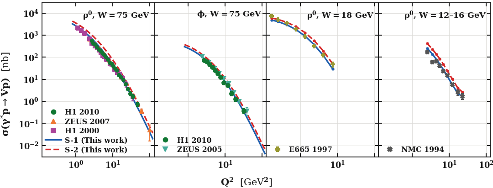 | 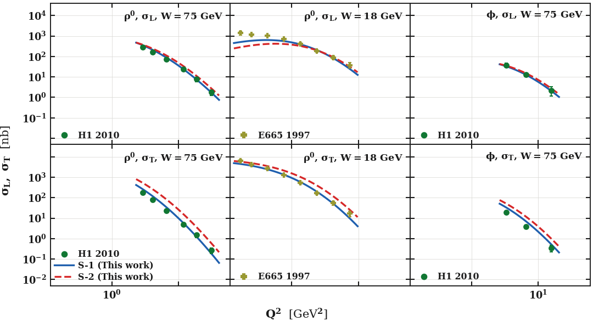 |
| σ(γ*p → Vp) against Q² | σ_L and σ_T against E665 |
| 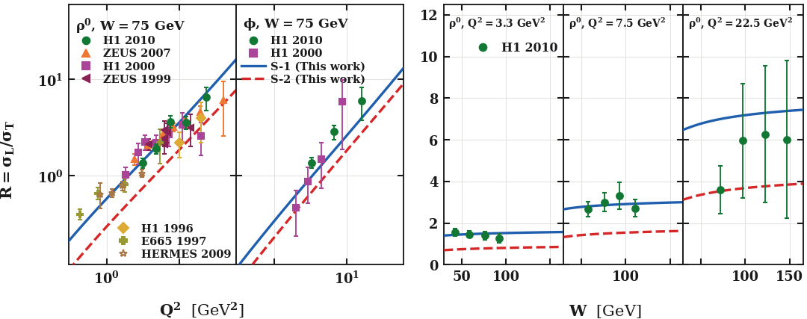 | 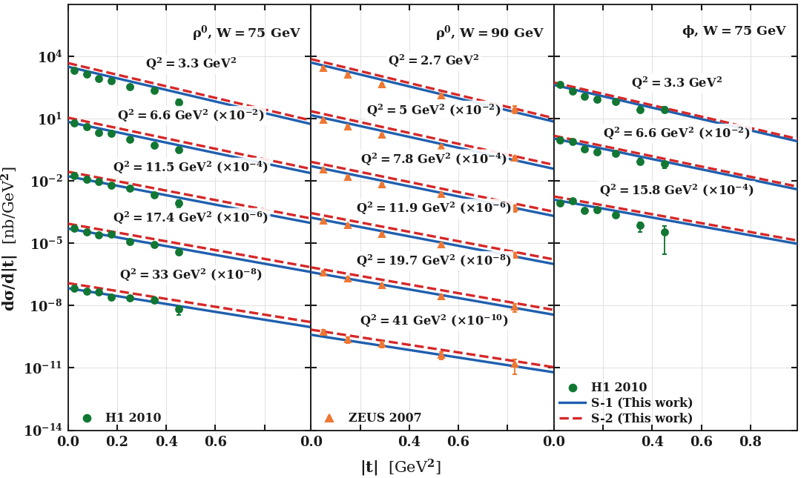 |
| R = σ_L/σ_T | dσ/dt |
| 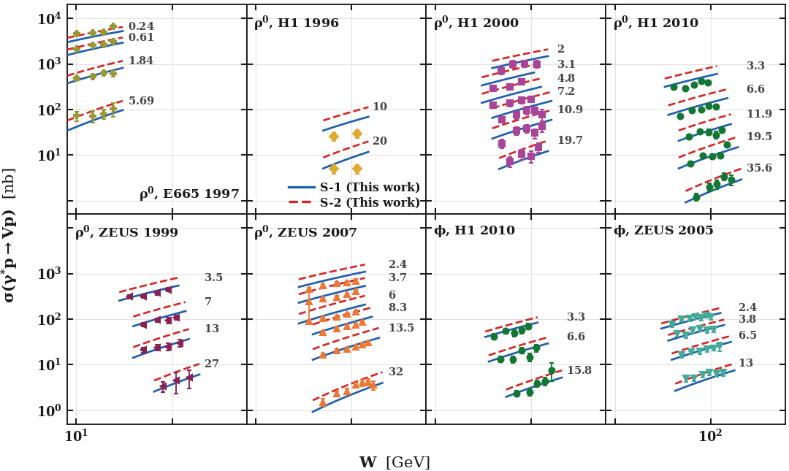 | 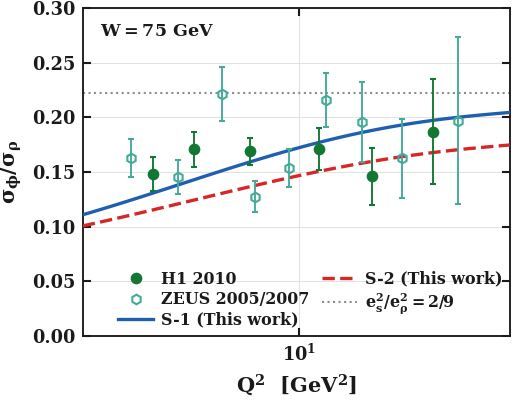 |
| W dependence | σ_φ/σ_ρ |
| 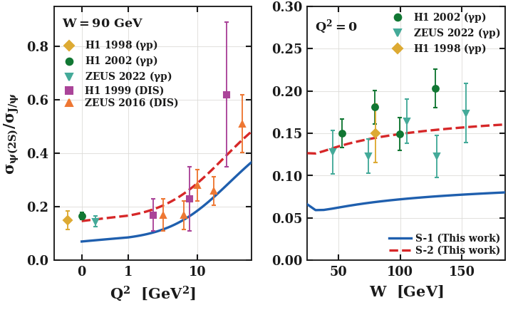 | 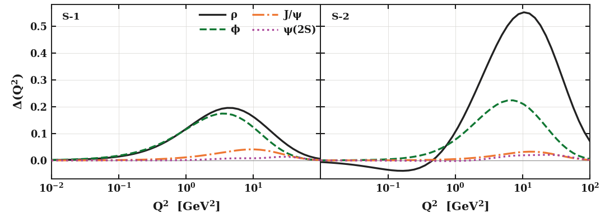 |
| σ_ψ(2S)/σ_J/ψ | angular condition, all four mesons |
| 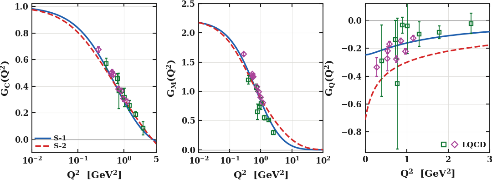 | 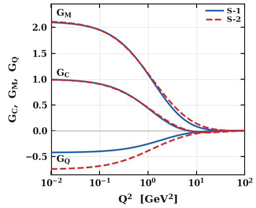 |
| ρ form factors against lattice QCD | φ form factors |
| 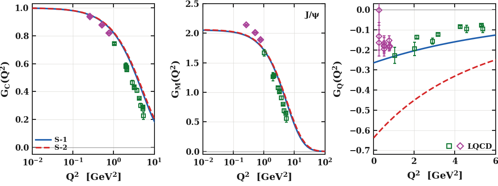 | 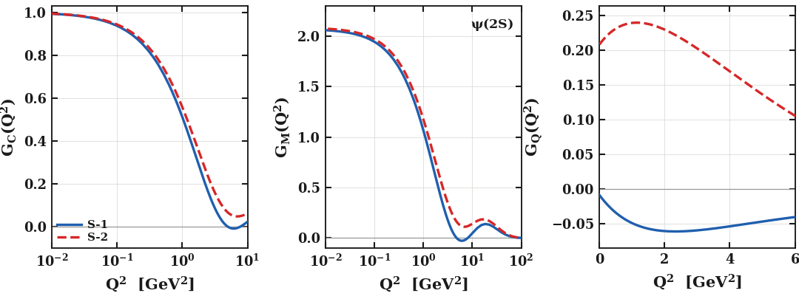 |
| J/ψ form factors against lattice QCD | ψ(2S) form factors |
| 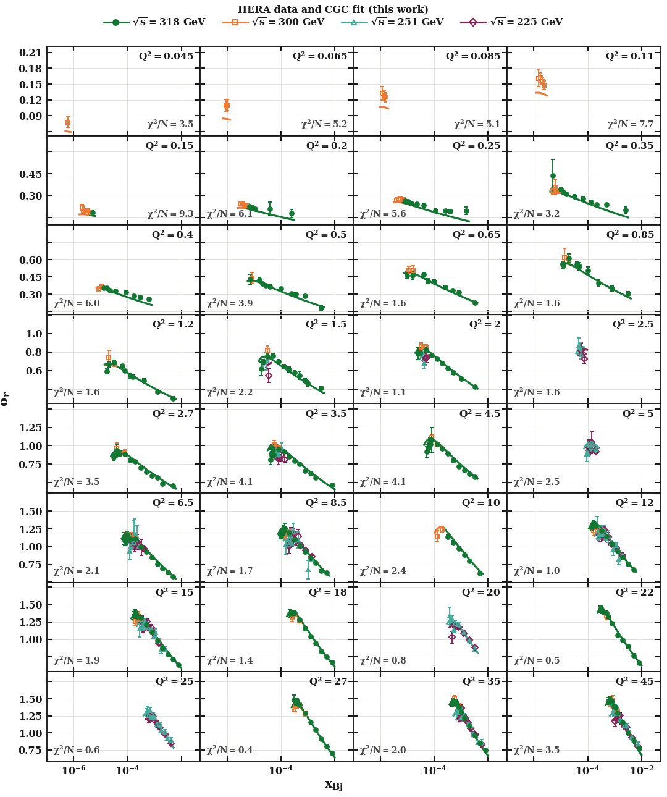 | 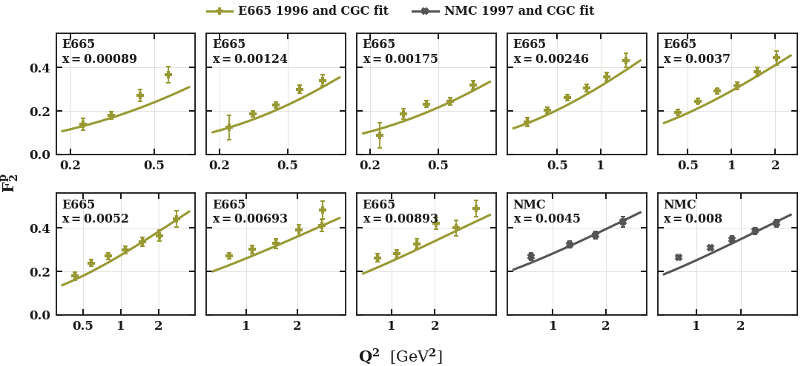 |
| dipole fit: HERA reduced cross section | dipole fit: fixed-target F₂ |
| 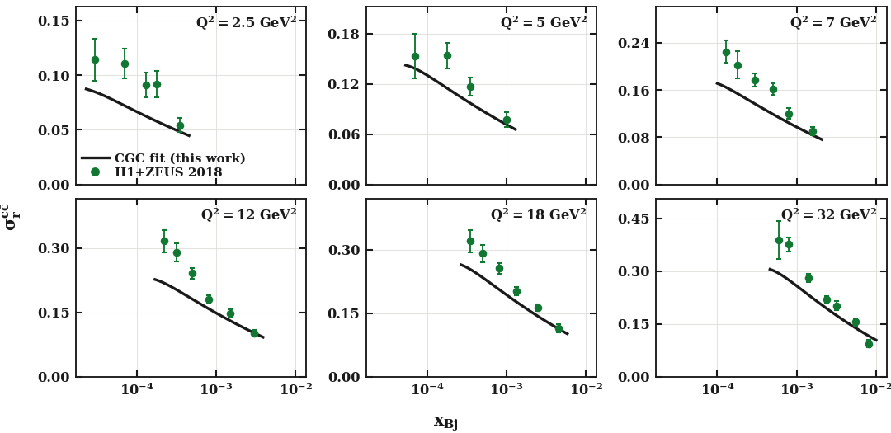 | |
| dipole fit: charm | |

Every figure is in [`figures/`](figures) as PNG and vector PDF.

## What's where

```
code/
  lfvm/                  the model
    wavefn.py            S-1 and S-2 wave functions, meson parameters
    cgc_dipole.py        CGC dipole cross section
    overlap.py           overlaps, amplitudes, cross sections, decay constants
    expdata.py           reads the measurements in data/
  rhophi_params.py       m_q, beta for rho and phi
  charmonium_params.py   m_c, beta, gamma for J/psi and psi(2S)
  fit_dipole_F2.py       dipole fit to the structure-function data
  dipole_checks.py       cross-checks against published dipole fits
  norms_and_fV.py        normalisation and decay constants
  ff_rho_phi.py          rho and phi form factors
  ff_charmonium.py       J/psi and psi(2S) form factors, chi2 vs lattice
  psi2s_ratio.py         psi(2S)/J/psi ratio vs HERA
  numbers_in_text.py     other numbers quoted in the paper
  plot_main.py, plot_charm.py, plot_F2fit.py, plotstyle.py
  run_all.sh             runs everything in order
data/                    all measurements (CSV, source in each header) and data/results/
figures/                 all figures
```

## Running it

You need Python 3 with NumPy, SciPy and Matplotlib.

```bash
pip install -r requirements.txt
bash code/run_all.sh
```

A full run takes about 25 minutes, most of it the two form-factor steps. The results are already included in `data/results/`, so you can also run just the plotting scripts, for example `cd code && python3 plot_main.py`.

## Data

**Diffractive data:**

- H1: 1996, 1998, 1999, 2000, 2002, 2010
- ZEUS: 1999, 2005, 2007, 2016, 2022
- E665 (1997), NMC (1994), HERMES (2009)

**Structure-function data:**

- HERA combined inclusive (2015) and charm (2018)
- fixed-target F₂ (E665, NMC)

**Lattice QCD form factors:**

- ρ: QCDSF 2008, HadSpec 2015
- J/ψ: Dudek et al. 2006, Delaney et al. 2023

Most tables are from HEPData. Each CSV file names its source in the header.

## Licence

[MIT](LICENSE) © 2026 Satyajit Puhan. The experimental and lattice data belong to their collaborations; please cite the original papers when you use them.
